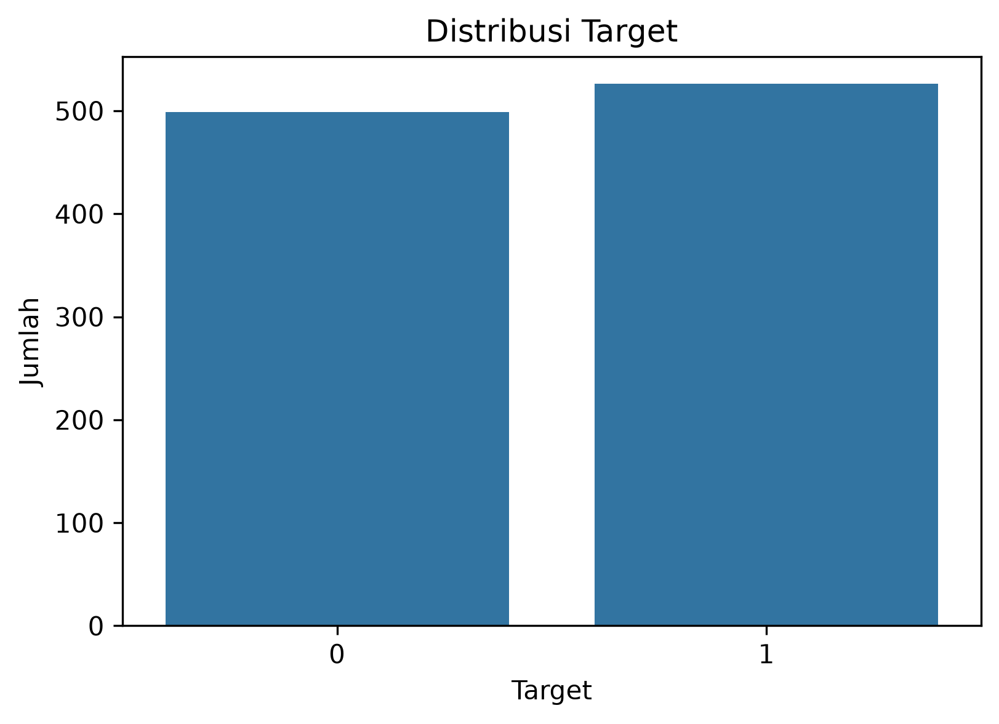
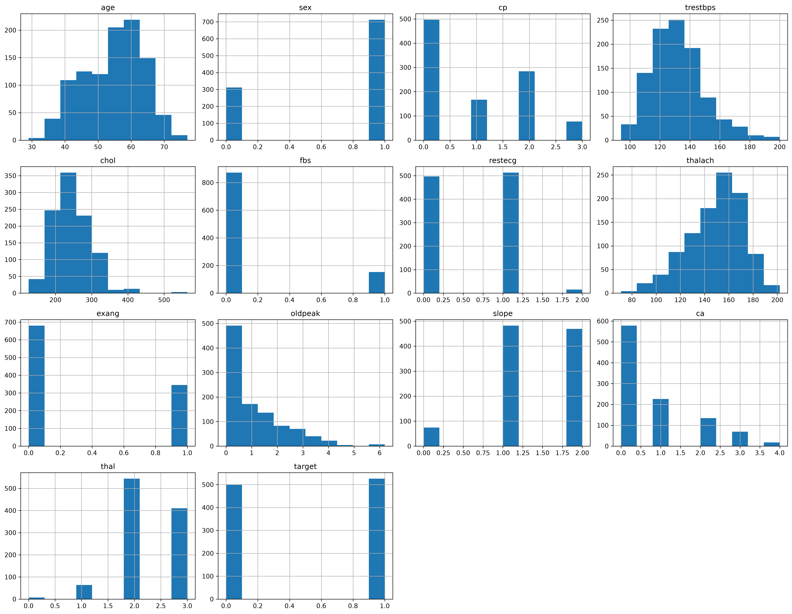
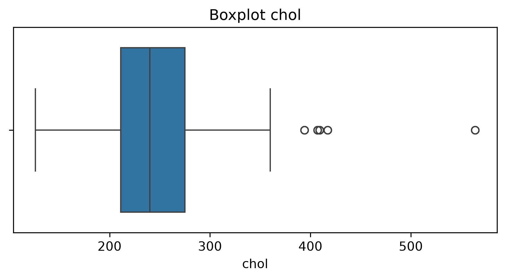
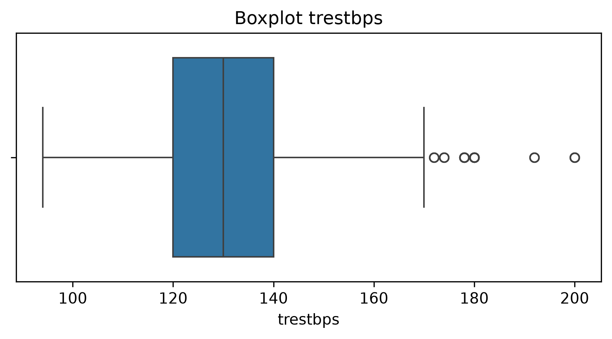
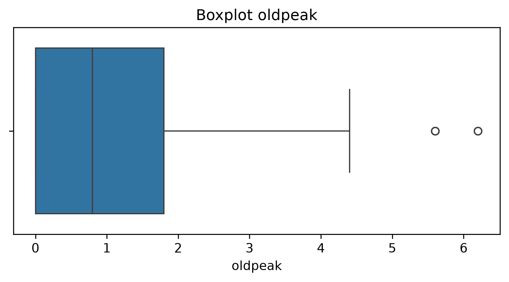
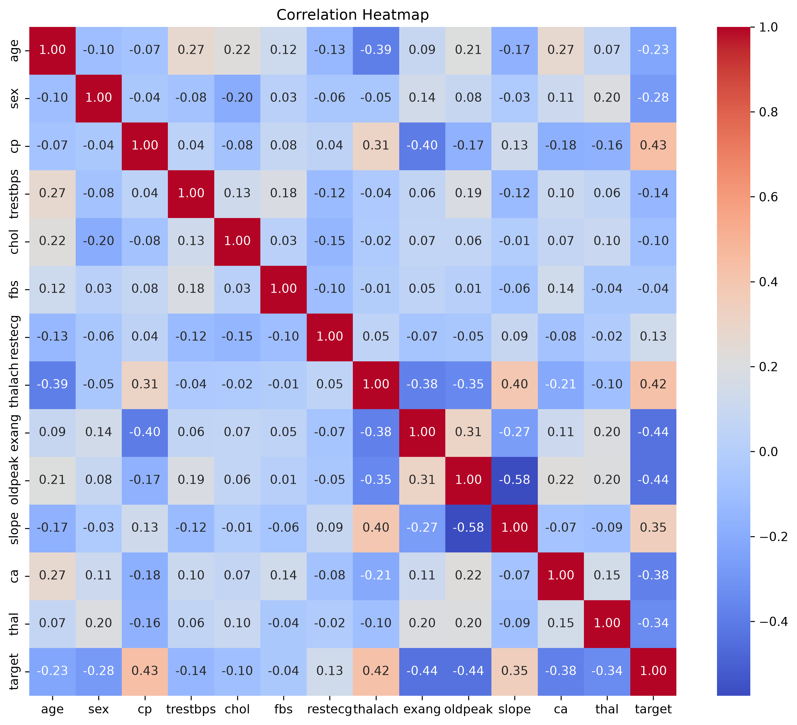
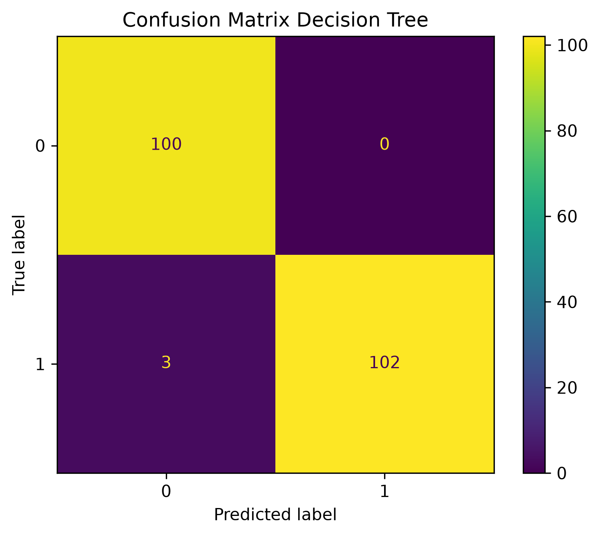
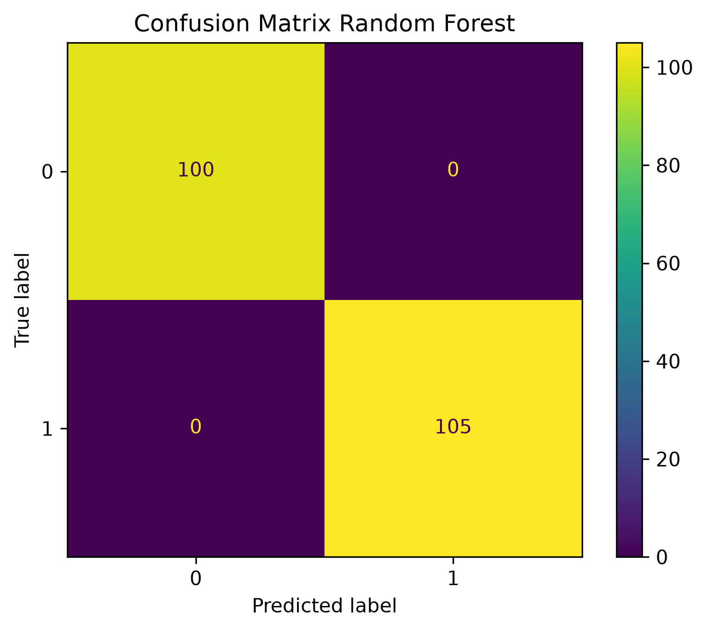

# Laporan UAS Kecerdasan Buatan

# Prediksi Penyakit Jantung Menggunakan Algoritma Decision Tree dan Random Forest

## Disusun Oleh

|       Nama       |   NIM   |
|------------------|---------|
| Nauval Al Ghafur | 2406035 |
| Sandi Febriansah | 2406001 |

---

# 1. Domain Proyek

## Latar Belakang

Penyakit jantung merupakan salah satu penyebab kematian tertinggi di dunia dan menjadi masalah kesehatan yang terus mendapatkan perhatian dari berbagai pihak. Menurut berbagai laporan kesehatan global, penyakit kardiovaskular menyebabkan jutaan kematian setiap tahunnya dan menjadi faktor utama menurunnya kualitas hidup masyarakat. Tingginya angka penderita penyakit jantung menunjukkan pentingnya upaya pencegahan dan deteksi dini agar risiko komplikasi dapat diminimalkan.

Dalam dunia medis, diagnosis penyakit jantung umumnya dilakukan melalui berbagai pemeriksaan seperti tekanan darah, kadar kolesterol, hasil elektrokardiogram, hingga riwayat kesehatan pasien. Proses tersebut membutuhkan waktu dan analisis yang cukup kompleks karena melibatkan banyak faktor yang saling berkaitan. Seiring berkembangnya teknologi, khususnya Artificial Intelligence (AI) dan Machine Learning, proses analisis data kesehatan dapat dilakukan secara lebih cepat dan sistematis.

Machine Learning memungkinkan komputer mempelajari pola dari data historis pasien dan menghasilkan prediksi terhadap kondisi kesehatan seseorang. Dengan memanfaatkan data kesehatan yang tersedia, model machine learning dapat membantu tenaga medis dalam mengidentifikasi pasien yang berpotensi mengalami penyakit jantung. Walaupun hasil prediksi tidak dapat menggantikan diagnosis dokter, model ini dapat berfungsi sebagai alat bantu pendukung keputusan (Decision Support System).

Pada proyek ini digunakan Heart Disease Dataset yang berisi berbagai informasi kesehatan pasien seperti usia, jenis kelamin, tekanan darah, kadar kolesterol, detak jantung maksimum, dan beberapa indikator medis lainnya. Dataset tersebut digunakan untuk membangun model klasifikasi yang mampu memprediksi apakah seorang pasien memiliki penyakit jantung atau tidak.

---

# 2. Business Understanding

## Problem Statement

Permasalahan yang ingin diselesaikan dalam proyek ini adalah:

1. Bagaimana memanfaatkan data kesehatan pasien untuk memprediksi kemungkinan penyakit jantung?
2. Algoritma machine learning apa yang memiliki performa terbaik dalam klasifikasi penyakit jantung?
3. Faktor-faktor apa yang memiliki hubungan dengan status penyakit jantung berdasarkan dataset yang digunakan?

---

## Goals

Tujuan dari proyek ini adalah:

1. Melakukan analisis terhadap dataset penyakit jantung.
2. Membangun model klasifikasi menggunakan machine learning.
3. Membandingkan performa beberapa algoritma klasifikasi.
4. Menentukan model terbaik berdasarkan hasil evaluasi.

---

## Solution Statement

Untuk mencapai tujuan tersebut digunakan dua algoritma klasifikasi:

### 1. Decision Tree

Decision Tree dipilih karena mudah dipahami dan mampu menghasilkan aturan keputusan yang jelas.

### 2. Random Forest

Random Forest dipilih karena merupakan metode ensemble learning yang mampu meningkatkan akurasi dan mengurangi overfitting.

Performa kedua model dibandingkan menggunakan metrik Accuracy, Precision, Recall, dan F1-Score.

---

# 3. Data Understanding

## 3.1 Sumber Dataset

Dataset yang digunakan dalam proyek ini adalah **Heart Disease Dataset** yang berisi data kesehatan pasien dan status penyakit jantung. Dataset ini banyak digunakan dalam penelitian machine learning dan data mining karena memiliki berbagai atribut yang berkaitan dengan kondisi kesehatan seseorang.

Data yang tersedia mencakup informasi demografis, hasil pemeriksaan medis, serta beberapa indikator kesehatan yang diketahui memiliki hubungan dengan penyakit jantung. Tujuan utama penggunaan dataset ini adalah untuk membangun model klasifikasi yang mampu memprediksi apakah seorang pasien memiliki penyakit jantung atau tidak berdasarkan karakteristik kesehatan yang dimiliki.

Variabel target pada dataset ini adalah kolom **target**, yang digunakan sebagai label klasifikasi. Nilai target terdiri dari dua kelas, yaitu:

- **0** : Pasien tidak memiliki penyakit jantung.
- **1** : Pasien memiliki penyakit jantung.

---

## 3.2 Karakteristik Dataset

Heart Disease Dataset merupakan dataset yang digunakan untuk menyelesaikan permasalahan **klasifikasi biner (binary classification)**. Setiap baris data merepresentasikan satu pasien dengan sejumlah atribut kesehatan yang digunakan sebagai variabel prediktor.

Dataset ini memiliki beberapa karakteristik sebagai berikut:

- Seluruh fitur telah berbentuk numerik sehingga tidak memerlukan proses encoding tambahan.
- Dataset memiliki kombinasi fitur numerik dan kategorikal yang telah direpresentasikan dalam bentuk angka.
- Variabel target memiliki dua kelas, yaitu pasien dengan penyakit jantung dan pasien tanpa penyakit jantung.
- Dataset relatif seimbang sehingga tidak memerlukan teknik penanganan data imbalance yang kompleks.

Karakteristik tersebut menjadikan dataset ini cukup ideal untuk digunakan dalam penerapan algoritma machine learning berbasis klasifikasi.

---

## 3.3 Informasi Dataset

Informasi umum mengenai dataset yang digunakan dapat dilihat pada tabel berikut.

| Informasi | Nilai |
|------------|------------|
| Jumlah Data | 1025 |
| Jumlah Kolom | 14 |
| Jumlah Fitur | 13 |
| Target | target |
| Jenis Masalah | Klasifikasi Biner |

Berdasarkan tabel di atas, dataset terdiri dari **1025 data pasien** dengan **14 kolom**, dimana **13 kolom digunakan sebagai fitur prediktor** dan **1 kolom digunakan sebagai variabel target**.

---

## 3.4 Deskripsi Variabel

Berikut adalah penjelasan masing-masing atribut yang terdapat pada dataset.

| Variabel | Deskripsi |
|------------|------------|
| age | Usia pasien dalam tahun |
| sex | Jenis kelamin pasien (0 = perempuan, 1 = laki-laki) |
| cp | Tipe nyeri dada (chest pain type) |
| trestbps | Tekanan darah saat istirahat (mmHg) |
| chol | Kadar kolesterol serum (mg/dl) |
| fbs | Kadar gula darah puasa |
| restecg | Hasil elektrokardiogram saat istirahat |
| thalach | Detak jantung maksimum yang dicapai |
| exang | Angina akibat aktivitas fisik |
| oldpeak | Depresi ST yang diinduksi oleh olahraga |
| slope | Kemiringan segmen ST saat puncak olahraga |
| ca | Jumlah pembuluh darah utama yang terdeteksi |
| thal | Status thalassemia |
| target | Status penyakit jantung |

Variabel-variabel tersebut digunakan sebagai input dalam proses pembelajaran model machine learning untuk memprediksi status penyakit jantung pasien.

---

## 3.5 Analisis Awal Dataset

Sebelum dilakukan proses eksplorasi data dan pemodelan, dilakukan analisis awal terhadap struktur dataset. Analisis ini bertujuan untuk memahami kondisi data secara umum serta mengidentifikasi potensi permasalahan yang dapat memengaruhi proses machine learning.

Berdasarkan hasil pemeriksaan dataset diperoleh beberapa temuan sebagai berikut:

- Dataset terdiri dari 1025 observasi dan 14 atribut.
- Seluruh atribut memiliki tipe data numerik sehingga dapat langsung digunakan dalam proses pemodelan.
- Tidak ditemukan nilai yang hilang (*missing value*) pada dataset.
- Distribusi kelas target relatif seimbang antara pasien yang memiliki penyakit jantung dan yang tidak memiliki penyakit jantung.
- Dataset memiliki kualitas data yang cukup baik sehingga tidak memerlukan proses pembersihan data yang kompleks.

Hasil analisis awal ini menunjukkan bahwa dataset siap digunakan untuk tahap berikutnya yaitu **Exploratory Data Analysis (EDA)** guna memperoleh pemahaman yang lebih mendalam mengenai pola dan hubungan antar variabel.

---

## 3.6 Deskripsi Variabel

| Variabel | Deskripsi |
|------------|------------|
| age | Usia pasien |
| sex | Jenis kelamin |
| cp | Tipe nyeri dada |
| trestbps | Tekanan darah saat istirahat |
| chol | Kadar kolesterol |
| fbs | Gula darah puasa |
| restecg | Hasil elektrokardiogram |
| thalach | Detak jantung maksimum |
| exang | Angina akibat olahraga |
| oldpeak | Depresi ST |
| slope | Kemiringan segmen ST |
| ca | Jumlah pembuluh darah utama |
| thal | Status thalassemia |
| target | Status penyakit jantung |

---

## 3.7 Kondisi Dataset

Hasil analisis menunjukkan:

- Dataset memiliki 1025 data.
- Dataset tidak memiliki missing value.
- Dataset memiliki distribusi target yang relatif seimbang.
- Seluruh fitur memiliki tipe data numerik.

Distribusi target:

| Target | Jumlah |
|----------|----------|
| 0 | 499 |
| 1 | 526 |

---

# 4. Exploratory Data Analysis (EDA)

## 4.1 Pendahuluan

Exploratory Data Analysis (EDA) merupakan tahapan penting dalam proses pengembangan model machine learning. Tahap ini bertujuan untuk memahami karakteristik data, mengidentifikasi pola yang terdapat dalam dataset, mendeteksi kemungkinan adanya outlier, serta mengetahui hubungan antar variabel yang dapat memengaruhi proses klasifikasi.

Melalui EDA, peneliti dapat memperoleh gambaran awal mengenai distribusi data dan faktor-faktor yang berpotensi berpengaruh terhadap status penyakit jantung. Hasil analisis pada tahap ini menjadi dasar dalam menentukan strategi preprocessing dan pemodelan yang akan digunakan pada tahap berikutnya.

---

## 4.2 Distribusi Variabel Target

Analisis pertama dilakukan terhadap variabel target untuk mengetahui distribusi jumlah pasien yang memiliki penyakit jantung dan yang tidak memiliki penyakit jantung.

Visualisasi distribusi target dilakukan menggunakan grafik batang (*countplot*).



### Analisis

Berdasarkan grafik distribusi target, terlihat bahwa jumlah data pada kedua kelas relatif seimbang. Kelas pasien yang memiliki penyakit jantung memiliki jumlah observasi yang tidak jauh berbeda dengan kelas pasien yang tidak memiliki penyakit jantung.

Kondisi ini menunjukkan bahwa dataset tidak mengalami masalah *class imbalance* yang signifikan. Dataset yang seimbang sangat menguntungkan dalam proses pelatihan model machine learning karena model tidak akan terlalu condong memprediksi salah satu kelas tertentu.

### Insight

- Dataset memiliki distribusi kelas yang relatif seimbang.
- Risiko bias model akibat ketidakseimbangan data relatif kecil.
- Tidak diperlukan teknik khusus untuk menangani masalah imbalance seperti oversampling atau undersampling.

---

## 4.3 Distribusi Seluruh Fitur

Setelah memahami distribusi target, analisis dilanjutkan dengan melihat distribusi masing-masing fitur menggunakan histogram.

Visualisasi histogram digunakan untuk mengetahui penyebaran nilai pada setiap variabel dan mengidentifikasi pola distribusi data.



### Analisis

Hasil histogram menunjukkan bahwa setiap fitur memiliki karakteristik distribusi yang berbeda. Beberapa fitur seperti **age**, **trestbps**, dan **thalach** memiliki distribusi yang relatif menyebar, sedangkan fitur seperti **sex**, **fbs**, dan **exang** hanya memiliki beberapa nilai unik karena merupakan representasi kategori yang telah dikonversi ke bentuk numerik.

Selain itu, terlihat bahwa sebagian besar pasien berada pada rentang usia menengah hingga lanjut usia. Hal ini sesuai dengan fakta bahwa risiko penyakit jantung cenderung meningkat seiring bertambahnya usia.

### Insight

- Dataset terdiri dari kombinasi fitur numerik dan fitur kategorikal yang telah dikodekan dalam bentuk angka.
- Distribusi beberapa fitur menunjukkan adanya variasi data yang cukup baik.
- Usia pasien cenderung berada pada rentang usia dewasa hingga lanjut usia.

---

## 4.4 Analisis Outlier

Outlier merupakan data yang memiliki nilai jauh berbeda dibandingkan mayoritas data lainnya. Dalam bidang kesehatan, outlier sering kali muncul karena adanya kondisi medis tertentu yang dialami pasien.

Pemeriksaan outlier dilakukan menggunakan visualisasi boxplot terhadap beberapa fitur numerik utama.

### Fitur Kolesterol (chol)



### Fitur Tekanan Darah (trestbps)



### Fitur Oldpeak



### Analisis

Berdasarkan hasil visualisasi boxplot, ditemukan beberapa nilai yang berada di luar rentang interquartile (IQR), terutama pada fitur **chol**, **trestbps**, dan **oldpeak**.

Pada fitur kolesterol terlihat beberapa pasien memiliki kadar kolesterol yang jauh lebih tinggi dibandingkan mayoritas pasien lainnya. Kondisi serupa juga ditemukan pada tekanan darah dan nilai oldpeak.

Meskipun secara statistik data tersebut dapat dikategorikan sebagai outlier, nilai tersebut masih dianggap valid karena berasal dari data medis nyata yang merepresentasikan kondisi kesehatan pasien tertentu.

### Insight

- Terdapat beberapa outlier pada fitur numerik.
- Outlier tidak langsung dihapus karena masih memiliki makna medis.
- Informasi outlier dapat menjadi indikator kondisi kesehatan yang ekstrem pada pasien.

---

## 4.5 Analisis Korelasi Antar Variabel

Tahap berikutnya adalah menganalisis hubungan antar variabel menggunakan matriks korelasi (*correlation matrix*).

Visualisasi dilakukan menggunakan heatmap untuk mempermudah identifikasi hubungan antar fitur.



### Analisis

Heatmap menunjukkan tingkat hubungan antar variabel yang dinyatakan dalam nilai korelasi antara -1 hingga 1.

Nilai korelasi yang mendekati angka 1 menunjukkan hubungan positif yang kuat, sedangkan nilai yang mendekati -1 menunjukkan hubungan negatif yang kuat.

Berdasarkan hasil analisis, beberapa fitur memiliki hubungan yang cukup kuat terhadap variabel target, yaitu:

- cp (Chest Pain Type)
- thalach (Maximum Heart Rate)
- oldpeak
- exang (Exercise Induced Angina)
- slope

Fitur-fitur tersebut berpotensi menjadi faktor penting dalam proses klasifikasi penyakit jantung karena menunjukkan keterkaitan yang lebih tinggi terhadap target dibandingkan fitur lainnya.

### Insight

- Beberapa fitur memiliki korelasi yang cukup kuat terhadap target.
- Fitur cp dan thalach menunjukkan hubungan yang relatif tinggi terhadap status penyakit jantung.
- Informasi korelasi dapat membantu memahami fitur yang paling berpengaruh dalam proses prediksi.

---

## 4.6 Kesimpulan Exploratory Data Analysis

Berdasarkan hasil Exploratory Data Analysis (EDA), diperoleh beberapa temuan penting sebagai berikut:

1. Dataset memiliki distribusi target yang relatif seimbang sehingga tidak memerlukan penanganan khusus terhadap class imbalance.
2. Sebagian besar fitur memiliki distribusi yang wajar dan dapat digunakan untuk proses pemodelan.
3. Ditemukan beberapa outlier pada fitur kolesterol, tekanan darah, dan oldpeak, namun nilai tersebut masih dianggap valid karena berasal dari data medis.
4. Beberapa fitur seperti cp, thalach, oldpeak, exang, dan slope menunjukkan hubungan yang cukup kuat terhadap target.
5. Dataset memiliki kualitas yang baik dan siap digunakan pada tahap Data Preparation dan Modeling.

Hasil EDA ini memberikan gambaran awal mengenai karakteristik data serta membantu dalam memahami faktor-faktor yang berpotensi memengaruhi prediksi penyakit jantung.

# 5. Data Preparation

## 5.1 Pendahuluan

Data Preparation merupakan tahapan yang dilakukan untuk mempersiapkan dataset sebelum digunakan dalam proses pelatihan model Machine Learning. Tahap ini bertujuan untuk memastikan bahwa data berada dalam kondisi yang optimal sehingga model dapat mempelajari pola data dengan lebih baik dan menghasilkan performa yang maksimal.

Pada penelitian ini, proses Data Preparation meliputi pemeriksaan kualitas data, pemisahan fitur dan target, pembagian data menjadi data latih dan data uji, serta standardisasi fitur menggunakan StandardScaler.

---

## 5.2 Pemeriksaan Missing Value

Missing value merupakan kondisi ketika terdapat nilai yang hilang pada suatu atribut dalam dataset. Keberadaan missing value dapat memengaruhi proses pelatihan model karena sebagian besar algoritma Machine Learning tidak dapat memproses data yang memiliki nilai kosong.

Pemeriksaan missing value dilakukan menggunakan fungsi berikut:

```python
df.isnull().sum()
```

### Hasil Analisis

Berdasarkan hasil pemeriksaan, tidak ditemukan missing value pada seluruh atribut dataset. Dengan demikian, tidak diperlukan proses penanganan missing value seperti imputasi atau penghapusan data.

### Insight

- Jumlah missing value pada seluruh atribut adalah 0.
- Dataset memiliki kualitas data yang baik.
- Tidak diperlukan proses data cleaning tambahan terkait missing value.

---

## 5.3 Pemeriksaan Data Duplikat

Data duplikat merupakan data yang memiliki informasi identik dengan data lainnya. Keberadaan data duplikat dapat menyebabkan bias pada proses pembelajaran model karena informasi tertentu menjadi lebih dominan dibandingkan data lainnya.

Pemeriksaan data duplikat dilakukan menggunakan fungsi:

```python
df.duplicated().sum()
```

### Hasil Analisis

Dataset diperiksa untuk mengetahui apakah terdapat data yang muncul lebih dari satu kali. Hasil pemeriksaan digunakan sebagai dasar untuk menentukan apakah diperlukan proses penghapusan data duplikat sebelum pemodelan dilakukan.

### Insight

- Pemeriksaan dilakukan untuk menjaga kualitas dataset.
- Data duplikat dapat memengaruhi performa model jika jumlahnya signifikan.
- Hasil pemeriksaan menunjukkan kondisi dataset sebelum memasuki tahap pemodelan.

---

## 5.4 Pemisahan Feature dan Target

Sebelum model Machine Learning dibangun, dataset perlu dipisahkan menjadi variabel independen (feature) dan variabel dependen (target).

Pada penelitian ini digunakan:

- **X** sebagai kumpulan fitur atau variabel prediktor.
- **y** sebagai variabel target yang akan diprediksi.

Variabel target yang digunakan adalah kolom **target** yang menunjukkan status penyakit jantung pasien.

Proses pemisahan dilakukan menggunakan kode berikut:

```python
X = df.drop('target', axis=1)
y = df['target']
```

### Hasil Analisis

Setelah proses pemisahan dilakukan, diperoleh:

- 13 atribut sebagai fitur prediktor.
- 1 atribut sebagai variabel target.

Fitur-fitur tersebut selanjutnya digunakan sebagai input dalam proses pelatihan model klasifikasi.

### Insight

- Variabel target berhasil dipisahkan dari fitur.
- Dataset siap digunakan untuk proses pembagian data training dan testing.

---

## 5.5 Pembagian Data Training dan Testing

Pada proses Machine Learning, data perlu dibagi menjadi data latih (*training data*) dan data uji (*testing data*).

Data training digunakan untuk melatih model agar dapat mempelajari pola yang terdapat dalam dataset, sedangkan data testing digunakan untuk mengukur kemampuan model dalam melakukan prediksi terhadap data yang belum pernah dilihat sebelumnya.

Pada penelitian ini digunakan rasio pembagian:

- 80% data training
- 20% data testing

Pembagian data dilakukan menggunakan fungsi berikut:

```python
train_test_split(
    X,
    y,
    test_size=0.2,
    random_state=42,
    stratify=y
)
```

### Alasan Penggunaan Parameter

#### test_size = 0.2

Sebanyak 20% data digunakan sebagai data pengujian sehingga model masih memiliki cukup data untuk proses pelatihan.

#### random_state = 42

Digunakan untuk memastikan hasil pembagian data dapat direproduksi pada setiap percobaan.

#### stratify = y

Digunakan untuk menjaga proporsi distribusi kelas target pada data training dan testing agar tetap seimbang.

### Hasil Analisis

Setelah proses pembagian dilakukan, dataset terbagi menjadi dua kelompok data yang siap digunakan untuk proses pelatihan dan evaluasi model.

### Insight

- Model akan diuji menggunakan data yang belum pernah dipelajari sebelumnya.
- Distribusi kelas tetap terjaga karena menggunakan stratifikasi.
- Proses evaluasi menjadi lebih objektif.

---

## 5.6 Standardisasi Data

Fitur pada dataset memiliki rentang nilai yang berbeda-beda. Sebagai contoh, atribut usia memiliki rentang puluhan tahun, sedangkan atribut kolesterol dapat memiliki rentang hingga ratusan satuan.

Perbedaan skala tersebut dapat memengaruhi proses pembelajaran model sehingga dilakukan standardisasi data menggunakan **StandardScaler**.

StandardScaler bekerja dengan mengubah data sehingga memiliki:

- Rata-rata (mean) mendekati 0.
- Standar deviasi (standard deviation) mendekati 1.

Proses standardisasi dilakukan menggunakan kode berikut:

```python
from sklearn.preprocessing import StandardScaler

scaler = StandardScaler()

X_train_scaled = scaler.fit_transform(X_train)

X_test_scaled = scaler.transform(X_test)
```

### Hasil Analisis

Setelah proses standardisasi dilakukan, seluruh fitur memiliki skala yang lebih seragam sehingga dapat membantu proses pelatihan model menjadi lebih stabil.

### Insight

- Perbedaan rentang nilai antar fitur berhasil diminimalkan.
- Dataset menjadi lebih siap untuk proses Machine Learning.
- Data hasil standardisasi digunakan sebagai input pada tahap Modeling.

---

## 5.7 Kesimpulan Data Preparation

Berdasarkan tahapan Data Preparation yang telah dilakukan, diperoleh beberapa hasil sebagai berikut:

1. Dataset tidak memiliki missing value sehingga tidak memerlukan proses imputasi data.
2. Pemeriksaan data duplikat dilakukan untuk memastikan kualitas dataset sebelum pemodelan.
3. Dataset berhasil dipisahkan menjadi fitur (X) dan target (y).
4. Data dibagi menjadi data training sebesar 80% dan data testing sebesar 20%.
5. Distribusi kelas tetap terjaga melalui penggunaan metode stratifikasi.
6. Seluruh fitur berhasil distandardisasi menggunakan StandardScaler sehingga memiliki skala yang lebih seragam.

Hasil Data Preparation menunjukkan bahwa dataset telah berada dalam kondisi yang siap digunakan untuk proses pembangunan model Machine Learning pada tahap berikutnya.

# 6. Modeling

## 6.1 Pendahuluan

Tahap Modeling merupakan proses pembangunan model Machine Learning menggunakan data yang telah dipersiapkan pada tahap sebelumnya. Tujuan utama dari tahap ini adalah menghasilkan model yang mampu mempelajari pola dari data kesehatan pasien dan melakukan prediksi terhadap status penyakit jantung.

Pada penelitian ini digunakan dua algoritma klasifikasi yang berbeda, yaitu **Decision Tree** dan **Random Forest**. Kedua algoritma dipilih karena memiliki kemampuan yang baik dalam menangani permasalahan klasifikasi serta sering digunakan dalam berbagai penelitian terkait prediksi penyakit.

Setelah model dilatih menggunakan data training, model kemudian digunakan untuk melakukan prediksi terhadap data testing yang selanjutnya akan dievaluasi pada tahap berikutnya.

---

# 6.2 Model 1: Decision Tree

## 6.2.1 Pengertian Decision Tree

Decision Tree merupakan salah satu algoritma Machine Learning yang bekerja dengan membentuk struktur pohon keputusan (*tree structure*). Algoritma ini melakukan pemisahan data berdasarkan atribut yang dianggap paling informatif hingga menghasilkan keputusan akhir berupa kelas prediksi.

Struktur Decision Tree terdiri dari:

- Root Node (akar pohon)
- Internal Node (percabangan)
- Leaf Node (hasil keputusan)

Pada setiap percabangan, algoritma memilih fitur terbaik berdasarkan kriteria tertentu seperti Gini Index atau Information Gain. Proses ini dilakukan secara berulang hingga seluruh data berhasil dipisahkan ke dalam kelompok yang paling homogen.

---

## 6.2.2 Alasan Pemilihan Decision Tree

Decision Tree dipilih karena memiliki beberapa keunggulan, antara lain:

1. Mudah dipahami dan diinterpretasikan.
2. Mampu menangani data numerik maupun kategorikal.
3. Tidak memerlukan asumsi distribusi data tertentu.
4. Proses pelatihan relatif cepat.
5. Cocok digunakan sebagai model dasar untuk klasifikasi.

Karena sifatnya yang sederhana dan interpretatif, Decision Tree sering digunakan sebagai model awal untuk memahami pola yang terdapat dalam dataset.

---

## 6.2.3 Implementasi Decision Tree

Model Decision Tree dibangun menggunakan library Scikit-Learn dengan parameter utama sebagai berikut:

```python
dt_model = DecisionTreeClassifier(
    random_state=42
)
```

Parameter `random_state=42` digunakan agar hasil pelatihan model dapat direproduksi pada setiap percobaan.

---

## 6.2.4 Proses Pelatihan Model

Model dilatih menggunakan data training yang telah dipersiapkan sebelumnya.

```python
dt_model.fit(
    X_train_scaled,
    y_train
)
```

Pada tahap ini model mempelajari hubungan antara fitur-fitur kesehatan pasien dengan status penyakit jantung yang terdapat pada variabel target.

---

## 6.2.5 Hasil Prediksi

Setelah proses pelatihan selesai, model digunakan untuk melakukan prediksi terhadap data testing.

```python
y_pred_dt = dt_model.predict(
    X_test_scaled
)
```

Hasil prediksi berupa klasifikasi pasien ke dalam dua kategori:

- 0 : Tidak memiliki penyakit jantung.
- 1 : Memiliki penyakit jantung.

Prediksi yang dihasilkan selanjutnya digunakan pada tahap evaluasi untuk mengukur performa model.

---

## 6.2.6 Insight Model Decision Tree

Berdasarkan proses pelatihan yang telah dilakukan, Decision Tree berhasil mempelajari pola hubungan antara atribut kesehatan pasien dengan status penyakit jantung.

Keunggulan utama model ini adalah kemampuannya dalam menghasilkan aturan keputusan yang mudah dipahami. Namun demikian, model Decision Tree memiliki kecenderungan mengalami overfitting apabila struktur pohon yang terbentuk terlalu kompleks.

---

# 6.3 Model 2: Random Forest

## 6.3.1 Pengertian Random Forest

Random Forest merupakan algoritma Machine Learning berbasis *Ensemble Learning* yang bekerja dengan membangun banyak Decision Tree kemudian menggabungkan hasil prediksi dari seluruh pohon tersebut.

Prinsip utama Random Forest adalah bahwa kombinasi banyak model sederhana sering kali menghasilkan performa yang lebih baik dibandingkan satu model tunggal.

Pada proses klasifikasi, setiap pohon dalam Random Forest memberikan prediksi, kemudian hasil akhir ditentukan berdasarkan suara mayoritas (*majority voting*).

---

## 6.3.2 Alasan Pemilihan Random Forest

Random Forest dipilih karena memiliki sejumlah keunggulan dibandingkan Decision Tree tunggal, yaitu:

1. Mengurangi risiko overfitting.
2. Memiliki akurasi yang lebih tinggi.
3. Lebih stabil terhadap variasi data.
4. Mampu menangani dataset dengan banyak fitur.
5. Dapat digunakan untuk mengetahui tingkat pentingnya fitur (*feature importance*).

Karena alasan tersebut, Random Forest menjadi salah satu algoritma klasifikasi yang paling populer dalam berbagai penelitian Machine Learning.

---

## 6.3.3 Implementasi Random Forest

Model Random Forest dibangun menggunakan library Scikit-Learn dengan parameter sebagai berikut:

```python
rf_model = RandomForestClassifier(
    n_estimators=100,
    random_state=42
)
```

Keterangan parameter:

- `n_estimators=100` menunjukkan jumlah pohon keputusan yang digunakan sebanyak 100 pohon.
- `random_state=42` digunakan agar hasil eksperimen dapat direproduksi.

---

## 6.3.4 Proses Pelatihan Model

Model Random Forest dilatih menggunakan data training yang sama dengan model Decision Tree.

```python
rf_model.fit(
    X_train_scaled,
    y_train
)
```

Pada tahap ini setiap pohon keputusan mempelajari pola data secara independen menggunakan sampel data yang berbeda melalui teknik bootstrap sampling.

---

## 6.3.5 Hasil Prediksi

Setelah proses pelatihan selesai, model digunakan untuk melakukan prediksi terhadap data testing.

```python
y_pred_rf = rf_model.predict(
    X_test_scaled
)
```

Prediksi yang dihasilkan akan dibandingkan dengan data aktual pada tahap evaluasi untuk mengetahui kemampuan model dalam mengklasifikasikan pasien.

---

## 6.3.6 Insight Model Random Forest

Model Random Forest berhasil dilatih menggunakan dataset penyakit jantung dan menghasilkan prediksi terhadap data testing.

Dibandingkan dengan Decision Tree, Random Forest memiliki kemampuan generalisasi yang lebih baik karena menggunakan banyak pohon keputusan. Pendekatan ini membantu mengurangi kesalahan prediksi yang dapat muncul pada model Decision Tree tunggal.

---

# 6.4 Perbandingan Model

Pada penelitian ini digunakan dua model klasifikasi yang memiliki karakteristik berbeda.

| Aspek | Decision Tree | Random Forest |
|---------|---------|---------|
| Jenis Algoritma | Tree-Based | Ensemble Tree-Based |
| Interpretasi | Sangat Mudah | Lebih Kompleks |
| Kecepatan Training | Cepat | Sedang |
| Risiko Overfitting | Tinggi | Rendah |
| Stabilitas Model | Sedang | Tinggi |
| Akurasi Umum | Baik | Sangat Baik |

Berdasarkan karakteristik tersebut, Decision Tree digunakan sebagai model dasar klasifikasi, sedangkan Random Forest digunakan sebagai model pembanding yang diharapkan mampu memberikan performa yang lebih baik.

---

# 6.5 Kesimpulan Modeling

Tahap Modeling berhasil menghasilkan dua model klasifikasi yang digunakan untuk memprediksi status penyakit jantung pasien, yaitu Decision Tree dan Random Forest.

Kedua model telah dilatih menggunakan data training yang sama sehingga hasil evaluasinya dapat dibandingkan secara objektif. Hasil prediksi dari masing-masing model akan dianalisis lebih lanjut pada tahap Evaluation untuk menentukan model terbaik berdasarkan metrik performa yang digunakan.

# 7. Evaluation

## 7.1 Pendahuluan

Tahap Evaluation dilakukan untuk mengukur performa model Machine Learning yang telah dibangun pada tahap sebelumnya. Evaluasi bertujuan untuk mengetahui sejauh mana model mampu melakukan klasifikasi status penyakit jantung secara akurat berdasarkan data testing yang belum pernah digunakan selama proses pelatihan.

Pada penelitian ini digunakan beberapa metrik evaluasi yang umum digunakan dalam permasalahan klasifikasi, yaitu Accuracy, Precision, Recall, F1-Score, serta Confusion Matrix. Penggunaan beberapa metrik evaluasi dilakukan agar performa model dapat dianalisis secara lebih komprehensif dan tidak hanya bergantung pada satu indikator saja.

Hasil evaluasi dari kedua model kemudian dibandingkan untuk menentukan model terbaik dalam memprediksi penyakit jantung.

---

# 7.2 Metode Evaluasi

## 7.2.1 Accuracy

Accuracy merupakan metrik yang digunakan untuk mengukur proporsi prediksi yang benar dibandingkan dengan seluruh data yang diuji.

Rumus Accuracy:

\[
Accuracy = \frac{TP + TN}{TP + TN + FP + FN}
\]

Keterangan:

- TP (True Positive): Prediksi positif yang benar.
- TN (True Negative): Prediksi negatif yang benar.
- FP (False Positive): Prediksi positif yang salah.
- FN (False Negative): Prediksi negatif yang salah.

Semakin tinggi nilai Accuracy, semakin baik kemampuan model dalam melakukan klasifikasi.

---

## 7.2.2 Precision

Precision digunakan untuk mengukur ketepatan model ketika memprediksi kelas positif.

Rumus Precision:

\[
Precision = \frac{TP}{TP + FP}
\]

Nilai Precision yang tinggi menunjukkan bahwa model jarang melakukan kesalahan ketika memprediksi pasien memiliki penyakit jantung.

---

## 7.2.3 Recall

Recall digunakan untuk mengukur kemampuan model dalam menemukan seluruh data positif yang sebenarnya.

Rumus Recall:

\[
Recall = \frac{TP}{TP + FN}
\]

Dalam kasus prediksi penyakit jantung, Recall menjadi penting karena menunjukkan kemampuan model dalam mendeteksi pasien yang benar-benar memiliki penyakit jantung.

---

## 7.2.4 F1-Score

F1-Score merupakan rata-rata harmonik antara Precision dan Recall.

Rumus F1-Score:

\[
F1 = 2 \times \frac{Precision \times Recall}{Precision + Recall}
\]

Metrik ini digunakan ketika diperlukan keseimbangan antara Precision dan Recall.

---

## 7.2.5 Confusion Matrix

Confusion Matrix merupakan tabel yang digunakan untuk melihat jumlah prediksi yang benar maupun salah pada masing-masing kelas.

Komponen utama Confusion Matrix terdiri dari:

- True Positive (TP)
- True Negative (TN)
- False Positive (FP)
- False Negative (FN)

Melalui Confusion Matrix, dapat diketahui jenis kesalahan yang dilakukan oleh model selama proses klasifikasi.

---

# 7.3 Evaluasi Model Decision Tree

## 7.3.1 Hasil Evaluasi

Berdasarkan hasil pengujian terhadap data testing, model Decision Tree memperoleh nilai sebagai berikut:

| Metrik | Nilai |
|----------|----------|
| Accuracy | 0.985366 |
| Precision | 1.000000 |
| Recall | 0.971429 |
| F1-Score | 0.985507 |

---

## 7.3.2 Confusion Matrix Decision Tree



### Analisis

Berdasarkan hasil Confusion Matrix, model Decision Tree mampu mengklasifikasikan sebagian besar data dengan benar. Nilai Precision sebesar 1.000 menunjukkan bahwa seluruh prediksi positif yang dihasilkan model merupakan prediksi yang benar.

Nilai Recall sebesar 0.971 menunjukkan bahwa masih terdapat sejumlah kecil kasus positif yang tidak berhasil dideteksi oleh model. Hal ini mengindikasikan adanya beberapa False Negative, yaitu pasien yang sebenarnya memiliki penyakit jantung namun diprediksi tidak memiliki penyakit jantung.

Secara keseluruhan, nilai Accuracy sebesar 98,54% menunjukkan bahwa model memiliki performa yang sangat baik dalam melakukan klasifikasi.

### Insight

- Model mampu memberikan akurasi yang sangat tinggi.
- Tidak ditemukan False Positive.
- Masih terdapat sejumlah kecil False Negative.
- Performa model sangat baik untuk klasifikasi penyakit jantung.

---

# 7.4 Evaluasi Model Random Forest

## 7.4.1 Hasil Evaluasi

Berdasarkan hasil pengujian terhadap data testing, model Random Forest memperoleh nilai sebagai berikut:

| Metrik | Nilai |
|----------|----------|
| Accuracy | 1.000000 |
| Precision | 1.000000 |
| Recall | 1.000000 |
| F1-Score | 1.000000 |

---

## 7.4.2 Confusion Matrix Random Forest



### Analisis

Berdasarkan hasil Confusion Matrix, model Random Forest berhasil mengklasifikasikan seluruh data testing dengan benar.

Nilai Accuracy, Precision, Recall, dan F1-Score yang mencapai 1.000 menunjukkan bahwa model tidak menghasilkan kesalahan klasifikasi pada data testing yang digunakan dalam penelitian ini.

Hasil tersebut menunjukkan bahwa pendekatan ensemble learning yang digunakan oleh Random Forest mampu meningkatkan kemampuan model dalam mempelajari pola data dibandingkan dengan Decision Tree tunggal.

### Insight

- Tidak ditemukan False Positive maupun False Negative.
- Seluruh data testing berhasil diklasifikasikan dengan benar.
- Model menunjukkan performa yang sangat baik pada dataset yang digunakan.

---

# 7.5 Perbandingan Hasil Evaluasi

Untuk menentukan model terbaik, dilakukan perbandingan berdasarkan seluruh metrik evaluasi yang digunakan.

| Model | Accuracy | Precision | Recall | F1-Score |
|---------|---------|---------|---------|---------|
| Decision Tree | 0.985366 | 1.000000 | 0.971429 | 0.985507 |
| Random Forest | 1.000000 | 1.000000 | 1.000000 | 1.000000 |

---

## Analisis Perbandingan

Berdasarkan hasil evaluasi yang diperoleh, kedua model menunjukkan performa yang sangat baik dalam melakukan klasifikasi penyakit jantung. Namun demikian, terdapat perbedaan performa pada beberapa metrik evaluasi.

Model Decision Tree berhasil mencapai Accuracy sebesar 98,54%, yang menunjukkan bahwa hampir seluruh data testing berhasil diklasifikasikan dengan benar. Walaupun demikian, nilai Recall yang sedikit lebih rendah menunjukkan bahwa masih terdapat sejumlah kecil kasus penyakit jantung yang tidak berhasil dideteksi.

Di sisi lain, Random Forest menunjukkan performa yang lebih unggul dengan memperoleh nilai sempurna pada seluruh metrik evaluasi. Hal ini menunjukkan bahwa seluruh data testing berhasil diprediksi dengan benar tanpa menghasilkan kesalahan klasifikasi.

Hasil tersebut menunjukkan bahwa penggunaan metode ensemble learning pada Random Forest mampu meningkatkan kemampuan generalisasi model dibandingkan dengan penggunaan satu pohon keputusan pada Decision Tree.

---

# 7.6 Pemilihan Model Terbaik

Pemilihan model terbaik dilakukan berdasarkan hasil evaluasi yang telah diperoleh.

Berdasarkan nilai Accuracy, Precision, Recall, dan F1-Score, model **Random Forest** dipilih sebagai model terbaik karena memiliki performa paling tinggi dibandingkan model Decision Tree.

Selain menghasilkan Accuracy sebesar 100%, model Random Forest juga mampu mencapai Precision, Recall, dan F1-Score sempurna, yang menunjukkan kemampuan klasifikasi yang sangat baik pada dataset Heart Disease.

---

# 7.7 Kesimpulan Evaluation

Berdasarkan hasil evaluasi yang telah dilakukan, diperoleh beberapa kesimpulan sebagai berikut:

1. Kedua model berhasil melakukan klasifikasi penyakit jantung dengan performa yang sangat baik.
2. Decision Tree memperoleh Accuracy sebesar 98,54% dengan Precision 100% dan Recall 97,14%.
3. Random Forest memperoleh nilai sempurna pada seluruh metrik evaluasi yang digunakan.
4. Random Forest menunjukkan kemampuan klasifikasi yang lebih baik dibandingkan Decision Tree.
5. Berdasarkan seluruh metrik evaluasi, Random Forest dipilih sebagai model terbaik pada penelitian ini.

Hasil evaluasi menunjukkan bahwa pendekatan ensemble learning yang digunakan oleh Random Forest sangat efektif dalam memprediksi penyakit jantung berdasarkan data kesehatan pasien.

# 8. Conclusion

## 8.1 Kesimpulan

Penelitian ini bertujuan untuk membangun model Machine Learning yang mampu memprediksi kemungkinan penyakit jantung berdasarkan data kesehatan pasien. Proses penelitian dilakukan melalui beberapa tahapan utama, yaitu Business Understanding, Data Understanding, Exploratory Data Analysis (EDA), Data Preparation, Modeling, dan Evaluation.

Berdasarkan hasil analisis dan eksperimen yang telah dilakukan, diperoleh beberapa kesimpulan sebagai berikut:

1. **Machine Learning dapat digunakan untuk memprediksi penyakit jantung secara efektif.**  
   Dengan memanfaatkan data kesehatan pasien seperti usia, tekanan darah, kadar kolesterol, detak jantung maksimum, dan atribut kesehatan lainnya, model Machine Learning mampu mempelajari pola yang berkaitan dengan status penyakit jantung dan menghasilkan prediksi yang akurat.

2. **Dataset Heart Disease memiliki kualitas data yang baik untuk proses pemodelan.**  
   Hasil analisis menunjukkan bahwa dataset tidak memiliki missing value, seluruh atribut telah berbentuk numerik, serta distribusi kelas target relatif seimbang. Kondisi ini memudahkan proses preprocessing dan mendukung pembangunan model yang lebih optimal.

3. **Exploratory Data Analysis (EDA) berhasil memberikan pemahaman mengenai karakteristik data.**  
   Hasil EDA menunjukkan bahwa beberapa fitur seperti *cp* (chest pain type), *thalach* (maximum heart rate), *oldpeak*, *exang*, dan *slope* memiliki hubungan yang cukup kuat terhadap status penyakit jantung. Informasi ini menunjukkan bahwa atribut-atribut tersebut berperan penting dalam proses klasifikasi.

4. **Dua model klasifikasi berhasil dibangun dan diuji pada dataset yang sama.**  
   Algoritma Decision Tree digunakan sebagai model dasar klasifikasi, sedangkan Random Forest digunakan sebagai model ensemble learning yang bertujuan meningkatkan performa prediksi dan mengurangi risiko overfitting.

5. **Model Decision Tree menunjukkan performa yang sangat baik.**  
   Berdasarkan hasil evaluasi, model Decision Tree memperoleh Accuracy sebesar **98,54%**, Precision sebesar **100%**, Recall sebesar **97,14%**, dan F1-Score sebesar **98,55%**. Hasil ini menunjukkan bahwa Decision Tree mampu melakukan klasifikasi penyakit jantung dengan tingkat akurasi yang sangat tinggi.

6. **Model Random Forest memberikan performa terbaik pada penelitian ini.**  
   Hasil evaluasi menunjukkan bahwa Random Forest memperoleh nilai Accuracy, Precision, Recall, dan F1-Score sebesar **100%**. Dengan hasil tersebut, Random Forest mampu mengklasifikasikan seluruh data testing dengan benar dan menunjukkan performa yang lebih unggul dibandingkan Decision Tree.

7. **Random Forest dipilih sebagai model terbaik untuk prediksi penyakit jantung.**  
   Berdasarkan seluruh metrik evaluasi yang digunakan, Random Forest menjadi model dengan performa terbaik karena menghasilkan tingkat klasifikasi yang lebih tinggi dan lebih stabil dibandingkan Decision Tree.

Secara keseluruhan, hasil penelitian menunjukkan bahwa pendekatan Machine Learning, khususnya menggunakan algoritma Random Forest, memiliki potensi yang sangat baik untuk digunakan sebagai alat bantu dalam proses deteksi dini penyakit jantung berdasarkan data kesehatan pasien.

---

## 8.2 Saran dan Pengembangan Selanjutnya

Meskipun penelitian ini telah menghasilkan performa model yang sangat baik, masih terdapat beberapa hal yang dapat dikembangkan pada penelitian berikutnya, antara lain:

1. **Menggunakan dataset yang lebih besar dan lebih beragam.**  
   Dataset dengan jumlah data yang lebih banyak dapat membantu model mempelajari pola yang lebih kompleks dan meningkatkan kemampuan generalisasi terhadap data baru.

2. **Melakukan Hyperparameter Tuning.**  
   Penggunaan teknik seperti Grid Search atau Random Search dapat digunakan untuk mencari kombinasi parameter terbaik sehingga performa model dapat ditingkatkan lebih lanjut.

3. **Menggunakan teknik validasi tambahan.**  
   Metode seperti Cross Validation dapat digunakan untuk memastikan bahwa model tidak hanya bekerja baik pada data testing tertentu, tetapi juga memiliki kemampuan generalisasi yang baik pada berbagai subset data.

4. **Membandingkan dengan algoritma lain.**  
   Penelitian berikutnya dapat membandingkan Random Forest dengan algoritma lain seperti Support Vector Machine (SVM), XGBoost, Gradient Boosting, atau Neural Network untuk mengetahui algoritma yang paling optimal.

5. **Mengembangkan sistem berbasis web atau mobile.**  
   Model yang telah dibangun dapat diimplementasikan ke dalam aplikasi berbasis web maupun mobile sehingga dapat digunakan sebagai alat bantu prediksi penyakit jantung secara lebih praktis.

6. **Melakukan analisis fitur yang lebih mendalam.**  
   Penelitian selanjutnya dapat memanfaatkan teknik Feature Importance atau Explainable AI (XAI) untuk mengetahui faktor-faktor yang paling berpengaruh terhadap prediksi penyakit jantung.

---

## 8.3 Penutup

Berdasarkan seluruh tahapan yang telah dilakukan, penelitian ini berhasil menunjukkan bahwa Machine Learning dapat dimanfaatkan untuk membantu proses prediksi penyakit jantung secara efektif. Hasil yang diperoleh menunjukkan bahwa pemanfaatan data kesehatan pasien melalui pendekatan kecerdasan buatan memiliki potensi besar untuk mendukung pengambilan keputusan dalam bidang kesehatan serta menjadi dasar pengembangan sistem deteksi dini penyakit jantung yang lebih cerdas di masa depan.

# 9. Future Work

Pengembangan yang dapat dilakukan pada penelitian berikutnya antara lain:

- Menambah jumlah data.
- Melakukan hyperparameter tuning.
- Menggunakan algoritma lain seperti XGBoost atau SVM.
- Mengembangkan sistem prediksi berbasis web atau mobile.

---